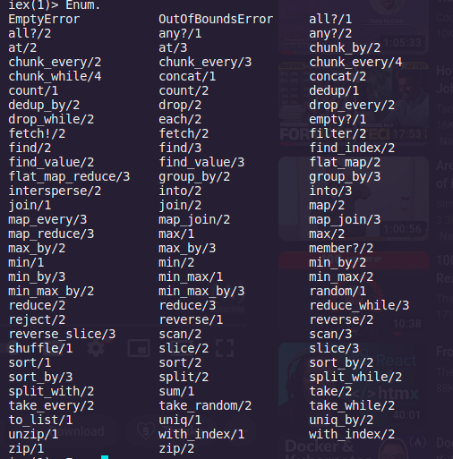

# learning-elixir
* Elixir - a functional programme 
* Supports immutability by default
* Useful for building fault tolerant systems
  
## Functional Programming
* Program made of different functions
* No classes
* Immutable data types/constant, hence data can be distributed easily
* No for loops. In loops i increases i.e mutates
* Recursive Mutation  

## Installation
* `sudo apt install elixir`
* ` elixir -v`

## Basics
### == is the match operator, not assignment
`a = 1`

### Elixir interactive shell 
`iex`

### Pattern match
In Elixir, the = operator is actually called the match operator. Let’s see why:


```
iex> x = 1
1
iex> 1 = x
1
iex> 2 = x
** (MatchError) no match of right hand side value: 1
```
1 = x is a valid expression, and it matched because both the left and right side are equal to 1. When the sides do not match, a MatchError is raised.

```
iex(1)> [x,x]=[1,1] //matches the pattern of rhs to lhs, then 1 is bound to var of a
[1, 1]
iex(2)> [x,y]=[1,1]
[1, 1]
iex(3)> [x,y]=[1,2]
[1, 2]
iex(4)> [x,x]=[1,2] //ERROR  
** (MatchError) no match of right hand side value: [1, 2]
    (stdlib) erl_eval.erl:453: :erl_eval.expr/5
    (iex) lib/iex/evaluator.ex:257: IEx.Evaluator.handle_eval/5
    (iex) lib/iex/evaluator.ex:237: IEx.Evaluator.do_eval/3
    (iex) lib/iex/evaluator.ex:215: IEx.Evaluator.eval/3
    (iex) lib/iex/evaluator.ex:103: IEx.Evaluator.loop/1
    (iex) lib/iex/evaluator.ex:27: IEx.Evaluator.init/4
iex(4)> x == 1
true
iex(5)> 1 == 1
true
iex(6)> 1 == x
true
iex(7)> x == x
true
iex(8)> x = 2
2
iex(9)> 1 == x
false
iex(10)> x == 1
false
iex(11)> a
** (CompileError) iex:11: undefined function a/0

iex(11)> x
2
```
### Pin operator
Variables in Elixir can be rebound:
```
iex> x = 1
1
iex> x = 2
2
```
If we dont wan't to allow rebound, we can use pin - pattern match against a variable’s existing value rather than rebinding the variable
## Livebook
Like Jupyter notebook, but for Elixir
```
iex> x = 1
1
iex> ^x = 2
** (MatchError) no match of right hand side value: 2
```

## Actor model
* Message --> Actor ---> Response
* Actors run inside processes
* At a time, we can have multiple processes - similar to threads    
* Since data is immutable, we can create  multiple copies and send them to processes, without worrying about any actor changing the state of the data
* Every process is identified by its PID
* Processes communicate through message passing
*  Each process has its Stack and Heap collection - so GC is fast

### Mailbox
* Messages passed by processes are collected by a mailbox
* Mailbox stores messages and executes them FIFO
* each mailbox requires <3kb memory, so cheap to create
  
### self
self is a function to get the current process id
```
iex(15)> self
#PID<0.104.0>
iex(16)> self()
#PID<0.104.0>
```
* Note : () are optional for running functions in elixir

### Elixir File extensions
* Scripts - .exs
* Compiled file - .ex

### Hello world program
* Code in `/scripts/hello.exs`
* Running script: 
  1.  elixir scripts/hello.exs
  2.  Compile and then run:
       elixirc scripts/hello.exs
       Creates a `Elixir.Hello.beam` file. Beam is the VM inside which Elixir runs
  3. Compiling script in iex
        ```
        iex(2)> c "hello.exs"
        warning: redefining module Hello (current version defined in memory)
          hello.exs:3
        
        Hello Elixir
        [Hello]
        iex(3)> Hello.world()
        Hello Elixir
        :ok
        ```
    4. ok - datatype
    5. Recompiling module
        ```
        iex(7)> r Hello          
        warning: redefining module Hello (current version defined in memory)
          hello.exs:3
        
        {:reloaded, Hello, [Hello]}
        iex(8)> Hello.world("aa")
        Hello  aa
        :iex(9)> Hello.world "aa" 
        Hello  aa
        :ok
        ```
## Data Types
All types are imutable
1. Atom -  `:some_name  ` The variable name and value are the same
```
:error
{:error,reason}={:error,"File not found"}
```
2. String - "new string"
Get details on var type:
```
iex(7)> i(reason)
Term
  "File not found"
Data type
  BitString
Byte size
  14
Description
  This is a string: a UTF-8 encoded binary. It's printed surrounded by
  "double quotes" because all UTF-8 encoded code points in it are printable.
Raw representation
  <<70, 105, 108, 101, 32, 110, 111, 116, 32, 102, 111, 117, 110, 100>>
Reference modules
  String, :binary
Implemented protocols
  Collectable, IEx.Info, Inspect, List.Chars, String.Chars
```
Concatenating parts of strings using pattern matching:
```
iex(8)> "H" <> rest = "Hello"
"Hello"
iex(9)> rest                 
"ello"
```
Check if a var is string :
is_binary(rest)

Pattern matching with raw representation of string 
```
iex(1)> name = "hello"
"hello"
iex(2)> <<head, rest::binary>> = name
"hello"
iex(3)> head
104 
iex(4)> rest
"ello"
```
3. Charlist
var a = 'abcd'

4. Process
my_pid = self()

5. List - Linked Lists   
    list = ["a","b","C"]
    # list[0]#doesn't work
    IO.puts(Enum.at(list,0))
Enum has a lot of in built functions
function signature : at/2 
`/2` - arity


Help : h Enum.at
6. TUPLE : {1,2}
To store large no of elements, list is recommended
7. MAP - Also kv structure
    my_map = %{a: 1, b: 2, c: 3}
8. Struct -
For structs, we need modules
#Struct
defmodule User do
  defstruct username: "", email: "", age: nil
end
## Flow Control
   1.  case 

    list = [1,2,3]
    case Enum.at(list,2) do
      1 -> IO.puts("This won't print")
      3 -> IO.puts("Match")
      _ -> IO.puts("Default, no match")
    end

   2.  Condition  
   cond do
    hd(list3) == 2 -> IO.puts("Got 2")
    true -> IO.puts("")
  end
  3. If else
  